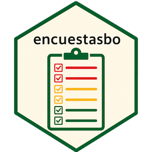

<!-- README.md se genera desde README.Rmd. Edita README.Rmd y corre devtools::build_readme(). -->

# encuestasbo 

<!-- badges: start -->

[](https://github.com/lab-tecnosocial/encuestasbo/actions/workflows/R-CMD-check.yaml)
[](https://lifecycle.r-lib.org/articles/stages.html#experimental)
<!-- badges: end -->

Paquete de R para el acceso, armonización y análisis de las encuestas
del Instituto Nacional de Estadística (INE) de Bolivia:

- **Encuesta de Hogares (EH)** — anual, **2012–2024** (13 años). Bases:
  `persona`, `vivienda` y los módulos temáticos (`equipamiento`,
  `gastos_alimentarios`, `gastos_no_alimentarios`,
  `seguridad_alimentaria`, `discriminacion`, `turismo`, `cultura`,
  `defunciones`) según el año.
- **Encuesta Continua de Empleo (ECE)** — trimestral, **4T-2015 a
  3T-2025** (40 trimestres). En 2020 (T2–T4) la ECE fue de cobertura
  solo urbana por la pandemia; el paquete los marca y avisa al usarlos.

Es el paquete hermano de
[`censosbo`](https://github.com/lab-tecnosocial/censosbo) y comparte su
arquitectura: Parquet + Apache Arrow (lazy), caché local y flujos estilo
`dplyr` / SQL vía DuckDB. La diferencia esencial: las encuestas son
**muestras con diseño complejo** (estratificado, bietápico, con factores
de expansión), por lo que el paquete integra `survey`/`srvyr` para
producir estimaciones e intervalos de confianza correctos.

Los microdatos están procesados y publicados: las funciones descargan
los Parquet desde GitHub Releases y los guardan en caché local
automáticamente.

## Instalación

``` r
# install.packages("remotes")
remotes::install_github("lab-tecnosocial/encuestasbo")
```

## Uso

``` r
library(encuestasbo)
library(dplyr)

# Inventario y ficha técnica oficial del INE (diseño muestral)
catalogo_eh()
ficha_tecnica("eh", 2023)        # universo, marco muestral, factor de expansión, ...

# Microdatos (Arrow lazy) con filtros
get_eh(2023, "persona", departamento = "Santa Cruz", area = "Urbana") |>
  count(depto) |>
  collect()

# Diccionario y etiquetas
codebook(buscar = "ingreso", anio = 2023)
get_eh(2023, "persona", as = "tibble") |> etiquetar_valores(anio = 2023)

# Armonización entre años (formato largo con columna `anio`)
# Respaldada por un único Parquet armonizado (~5 MB); modos tibble/arrow/duckdb
get_eh_armonizada(grupo = "pobreza")
get_eh_armonizada(as = "duckdb")   # consulta SQL cross-año sobre "eh_armonizada"
```

## Análisis con diseño muestral

``` r
library(srvyr)

# Tasa de pobreza nacional 2023 con IC (≈ cifra oficial del INE)
diseno_eh(2023) |>
  summarise(pobreza = survey_mean(pobre, na.rm = TRUE, vartype = "ci"))

# Ingreso medio del hogar por departamento
diseno_eh(2023) |>
  group_by(depto) |>
  summarise(ingreso = survey_mean(ingreso_hogar, na.rm = TRUE))

# Encuesta Continua de Empleo: tasa de desempleo del 4T-2023 (factor trimestral)
diseno_ece(2023, trimestre = 4) |>
  summarise(td = survey_ratio(pead, pea, na.rm = TRUE, vartype = "ci"))
```

`diseno_eh()` declara el diseño (`ids = upm`, `strata = estrato`,
`weights = factor`, `nest = TRUE`) sobre datos armonizados y devuelve un
objeto `srvyr`. Ver `vignette("diseno-muestral")`.

## Variables armonizadas

Nombres canónicos estables entre años, apoyados en las variables
derivadas del propio INE: ingresos (`ingreso_hogar`,
`ingreso_personal`), pobreza (`pobre`, `pobre_extremo`,
`linea_pobreza`), educación (`nivel_edu`, `anios_estudio`), empleo
(`condicion_actividad`, `pea`, `ocupado`), demografía (`sexo`, `edad`).

``` r
variables_armonizadas()
grupos_variables()
```

## Gestión del caché

``` r
encuestasbo_cache_dir(); encuestasbo_cache_info(); encuestasbo_cache_clear()
```

## Fuentes de datos

Todos los microdatos provienen del **Instituto Nacional de Estadística
(INE) de Bolivia**, de dos repositorios distintos:

- **Encuesta de Hogares (EH)** — portal **ANDA** del INE (catálogo
  ENCUESTAS): <https://anda.ine.gob.bo/index.php/catalog/ENCUESTAS>. La
  descarga de los `.sav` requiere registro/inicio de sesión y aceptar
  los términos de uso del INE.
- **Encuesta Continua de Empleo (ECE)** — página de **Metadatos y
  microdatos** del INE (acceso abierto, sin registro):
  <https://www.ine.gob.bo/index.php/metadatos-y-microdatos/> (los
  archivos se alojan en el repositorio Nextcloud del INE,
  `nube.ine.gob.bo`).

Este paquete **no** accede a esos portales en tiempo de ejecución: los
microdatos ya están procesados a Parquet y publicados en GitHub
Releases, de donde las funciones `get_*()` los descargan y cachean
automáticamente.

## Nota metodológica

Cada `.sav` del INE se lee con [`haven`](https://haven.tidyverse.org/)
(preservando sus etiquetas), del que se extrae el **codebook**; los
datos se guardan como códigos numéricos en Parquet (uno por
encuesta-periodo-tabla), conservando intactas las variables de diseño
muestral. La **armonización** entre periodos unifica nombres y
recodifica los valores que el INE cambió entre años (p. ej. tenencia de
la vivienda o categoría ocupacional de la ECE). Las **líneas de pobreza,
los factores de expansión y las variables derivadas** las calcula el
INE: el paquete las expone. Los resultados se contrastan con las cifras
oficiales del INE. Detalles de comparabilidad en
`vignette("armonizacion")` y `ficha_tecnica()`.

## Citación

Si usas `encuestasbo` en un trabajo, por favor cítalo. En R:

``` r
citation("encuestasbo")
```

> Ojeda Copa, A. (2026). *encuestasbo: Acceso, armonización y análisis
> con diseño muestral de las encuestas del INE de Bolivia*. Lab
> TecnoSocial. Paquete de R.
> <https://github.com/lab-tecnosocial/encuestasbo>

Cita además la **fuente primaria de los microdatos**: Instituto Nacional
de Estadística (INE) de Bolivia, Encuesta de Hogares / Encuesta Continua
de Empleo, según el periodo utilizado.
